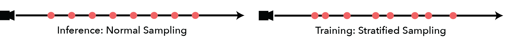

# Computational Robotics: NeRF or Nothing


## Goal

The goal of this assignment was to learn about Neural Radiance Fields. The learning process was two-fold:

1. Research NeRFs and understand how they work (understanding them from a theoretical perspective).
2. Recreate some of the NeRF functionality for ourselves (understanding the implementation). 

## Approach / Methodology
For this project, we first had to learn *a lot* about NeRFs and the underlying ML and computer vision theory that allows them to work.

We knew that given the time constraints of the project and our excessive curricular obligations, we needed an accessible library to help us implement NeRFs. Implementing them from scratch would have been over-scoped- and we wanted to use NeRFs for robotics applications moving forward. Thus, the goal was to learn how to use NeRFs to then generate meshes and Signed Distance Functions that we could use for other localization and more involved computer vision projects.  After researching, we found NeRF Studio, a NeRF API created by researchers at UC Berkeley. They provide scaffolding and infrastructure for the creation, usage, training, and rendering of NeRFs. We installed an iOS app called PolyMap that is usually for photogrammetry, and put that into dev mode so we could download their raw data. Nerf Studio has infrastructure for processing data from Polymap directly, so getting the data for our models ended up being a pretty straight-forward process.

To learn how NeRFs are implemented at a software-level we decided to do follow a similar procedure to that from the homeworks in our independent study in Deep Reinforcement Learning. The assignments in that class essentially leave certain functions or sections of code blank so that students create those algorithms for themselves. We did something similar, where we essentially gave each other "TODOs" that seemed algorithmically interesting within NeRF studio's existing codebase, and had each of us implement those functions ourselves. The functions we decided to focus on were the renderers, because they had intuitive behaviors and directly related to the NeRFs output. We didn't pay as much attention to scaffolding and data manipulation, for example. The four renderers we decided to re-write parts of were:

1. The Accumulation Renderer
2. The Depth Renderer
3. The RGB Renderer
4. The Normals Renderer

## Conceptual Explanation of Neural Radiance Fields (NeRF)

A Neural Radiance Field (NeRF) is a neural network-based method of creating new, photorealistic depictions of 3D scenes. To train a NeRF, one inputs a collection of images, along with their pose and orientation, into a neural network. This network interprets them in 3D space by casting rays through the images, training a continuous 3D function that contains color values matching those projected from the training images.

The input and output relationship of the NeRF model can be represented as:
$\text{Output: } (\mathbf{c}, \sigma) = \text{MLP}(\mathbf{x}; \mathbf{\Theta})
$
Where:
- $\mathbf{c} = (R, G, B)$ is the RGB color output.
- $\sigma$ is the volume density at that point.
- $\mathbf{x}$ is the input 5D coordinate.
- $\text{MLP}$ denotes the multi-layer perceptron.
- $\mathbf{\Theta}$ represents the learnable parameters of the MLP.

To create a new image from the NeRF, a clever sampling method is used. Imagine drawing a conic region through the image that grows larger as it approaches the camera. At each step along the vector, colors are sampled within a frustrum and accumulated along with depth and opacity values, which are weighted by the distance from neighboring samples. This blending of color, density, and depth values determines the final value at each pixel.

Here we can see the method with which rays are projected through an image. Each ray has an associated pixel and color value.

  
Citation - NeRFology

  
NeRF Paper

We project these rays for each of our training images. The data for these images is defined using a pose (x,y,z), an orientation (phi,theta), and an rgb image.


Image Projection  


Once the conic rays are cast through the image. We train our Radiance Field on the color values from the rays. Once we are done training, we will have a Neural Radiance Field.

  
NeRFology

This field cannot give us images directly. Our goal is to produce RGB values for a defined pose and orientation of a viewer camera within a scene. To produce this result we must use a method of raycasting frustrums back towards our camera using a series of Color, Depth, and Density Renderers.

Projected frustrums casting outwards from within a scene.  
  
NeRFology

Raycasting does have some drawbacks, however. Because it relies on sampling the field, it is entirely possible to over or under represent portions of the field which have high variance in color value, especially if uniform (equally spaced) sampling is used.

Here we have a uniformly and non uniformly sampled ray. Sampling more near highly variant regions will yield more accurate renders.  


In the actual NeRF model, we do both. We take a course sample of our NeRF using uniform sampling and then use the results to inform a fine pass where we sample more in variant regions.

After sampling, we have successfully created a new representation of our scene using a NeRF!

## Computer Graphics Theory: How NeRFs Came to Be (a precursor to NeRF theory)

To understand NeRFs, one must understand the theoretical foundation upon which NeRFs were created. That theory includes:

### Scenes 

Scenes are the subject of image synthesis. They are defined by geometry, appearance, lighting, and viewpoints. 

### Volume Density

The volume density is a function that gives the density of a medium in any given point in space. 

$\sigma(\mathbf{x}) : \mathbb{R}^3 \rightarrow \mathbb{R}
$ \
Where $\sigma$ maps from a point in 3D euclidean space to a real number, representing density. 

In computer graphics, and specifically in the context of Neural Radiance Fields (NeRF), the "density of a medium at a point in space" refers to a conceptual representation of how much matter or light-interactive material is present at a specific point in a scene being modeled. This is not about physical density as measured in real-world units like kilograms per cubic meter, but rather a value that indicates how much light is blocked or scattered at that point, which is essential for simulating light transport in a scene. When a ray of light hits a place with a high volume density, it suggests that part is likely to be part of an object. If the volume density is low, it means there's probably not much there. 

### Continuous Volumetric Functions

A continuous volumetric scene function is a continuous representation of scenes and objects. A scene is represented as a 5D vector-valued function with an input that is a 3D location $(x, y, z)$ and a 2D viewing direction $(\theta, \phi)$:

$f : (\mathbb{R}^3, S^2) \rightarrow (\mathbb{R}^3, \mathbb{R}) $

and the output is an emitted color (RGB) and volume density $\alpha$.

In other words, they map a 5-D coordinate (pose and orientation in space) to a volume density and RGB color.

## Optimizing Continuous Volumetric Functions

By accumulating (integrating) the density across different viewpoints and locations, novel views of the scene can be created:

$C(\mathbf{r}) = \int_{t_n}^{t_f} T(t) \sigma(\mathbf{r}(t)) \mathbf{c}(\mathbf{r}(t), \mathbf{d}) \, dt$

where:

- $C(\mathbf{r})$ is the color accumulated along ray $\mathbf{r}.$ 
- $\int$ denotes integration}. 
- $t_n$ and $t_f$ are the bounds of integration, representing the near and far bounds along the ray. 
- $T(t)$ is the accumulated transmittance along the ray until point t, which represents how much light is not absorbed. 
- $\sigma(\mathbf{r}(t))$ is the density at point t along ray $\mathbf{r}.$ 
- $\mathbf{c}(\mathbf{r}(t), \mathbf{d})$ is the color at poin t along ray $\mathbf{r}$, with direction $\mathbf{d}.$ 
- $dt$ is the differential segment of the ray.


## Neural Fields

Neural fields, also known as neural implicit functions, provide a framework for modeling continuous volumetric functions using neural networks. The relationship between neural fields and continuous volumetric functions is primarily based on how neural fields can represent complex and high-fidelity 3D geometries in a continuous manner. 

More generally, a neural field is a neural network that parameterizes a signal. It's common that the signal is a 3D scene or object, but that doesn't have to be the case. They are commonly used in computer graphics and image synthesis. In most neural field implementations, connected neural networks encode objects and scene properties. Only one network needs to be trained to encode/capture a scene. Unlike regular machine learning algorithms, the goal is to overfit your network rather than generalize it to different scenes. In other words, a single neural field encodes a single scene. They encode the scene in the weights of the network. 

Neural fields use neural networks to parameterize a continuous function that maps coordinates in space to some output values, such as color and density. These outputs can be sampled at any continuous point in space, allowing for the creation of a continuous volumetric scene or object representation.

## Why neural fields over alternative representations?

Unlike traditional volumetric representations that store explicit values in a grid (like voxels- which are basically 3D occupancy grids), neural fields use the weights of a neural network to implicitly encode the volume. This allows for a memory-efficient representation, as the neural network can represent a continuous volume without discretizing it into grid cells or pixels. 

Since neural fields use a neural network, they are differentiable with respect to both the input coordinates and the network parameters. This allows for the use of gradient-based optimization techniques to adjust the parameters of the network such that it can reproduce the characteristics of a given volumetric function based on observed data (ie. a set of 2D images).

## To train a neural field:

- Sample coordinates from a scene
- Feed them to a neural network to produce field quantities
- Sample the field quantities from the desired reconstruction domain of the problem
- Map the reconstruction back to the sensor domain (like the RGB image that you actually see on your laptop screen of the NeRF)
- Calculate the reconstruction error and optimize the neural network.

Mathematical Definitions:
The reconstruction is a neural field denoted as $f(\mathbf{x})$.

A sensor observation is also a neural field denoted as $g(\mathbf{x})$.

The forward map is a mapping between the two neural fields and is differentiable, denoted as $h(f(\mathbf{x}) = g(\mathbf{x}))$.

Thanks to these definitions, we can solve an optimization problem to calculate the neural field/ optimized continuous volumetric function, which is the process of training a NeRF.

## NeRF Theory

NeRFs use a deep neural network architecture to create 3D renders of scenes. They can operate on sparse data sets of images and poses. They use these images and their poses in 3D space to optimize a continuous volumetric scene function. The function can produce novel views of a complex scene. NeRFs are known for being able to produce high fidelity renders, especially in comparison to pre-NeRF methods like DeepSDF (deep Signed Distance Functions) and SRNs (Scene Representation Networks). To train a NeRF, you only need a set of images and their respective camera poses. Scenes are modeled implicitly through the weights of the feed-forward neural net.

### View Frustum in Camera Perspective
   A view frustum is the visible space (conic region) in the 3D world that gets projected onto the camera plane. Mathematically, it can be defined by the camera's intrinsic parameters and the near $z_{near}$ and far $z_{far}$ planes:

   $\text{Frustum} = \{ (x, y, z) \mid x, y \in \text{Image plane}, z_{near} \leq z \leq z_{far} \}
   $

### Ray Sampling within the Frustum
   For each pixel on the image plane, a ray $\mathbf{r}(t)$ is cast into the scene, which is represented by:

   $\mathbf{r}(t) = \mathbf{o} + t\mathbf{d}, \quad t \in [t_n, t_f]
   $

   where $\mathbf{o}$ is the ray origin, $\mathbf{d}$ is the normalized direction vector, and $t_n$ and $t_f$ are the intersections of the ray with the near and far planes of the frustum.

### Volume Integration along Rays
   The volume rendering integral accumulates color $\mathbf{c}$ and density $\sigma$ along the ray within the frustum:

   $C(\mathbf{r}) = \int_{t_n}^{t_f} T(t) \sigma(\mathbf{r}(t)) \mathbf{c}(\mathbf{r}(t), \mathbf{d}) \, dt
   $

   where $T(t)$ is the accumulated transmittance given by:

   $T(t) = \exp\left(-\int_{t_n}^{t} \sigma(\mathbf{r}(s)) \, ds\right)
   $

   This equation represents how the color and opacity at each point along the ray contribute to the final pixel color, taking into account the absorption and scattering of light.

### Optimization Across Multiple Frustums ##
   The NeRF model optimizes the neural network parameters $\theta$ by minimizing the difference between the rendered colors $C(\mathbf{r}$; $\theta$ and the observed colors $\mathbf{c}_{obs}$ from the training images, over all rays from all view frustums:

   $\min_\theta \sum_{\mathbf{r} \in \mathcal{R}} \| C(\mathbf{r}; \theta) - \mathbf{c}_{obs}(\mathbf{r}) \|^2
   $

   where $\mathcal{R}$ is the set of all rays cast from all pixels of all training images.

## Representing NeRFs as a Neural Network - Putting it all together

The input and output relationship of the NeRF model can be represented as:
$\text{Output: } (\mathbf{c}, \sigma) = \text{MLP}(\mathbf{x}; \mathbf{\Theta})
$
Where:
- $\mathbf{c} = (R, G, B)$ is the RGB color output.
- $\sigma$ is the volume density at that point.
- $\mathbf{x}$ is the input 5D coordinate.
- $\text{MLP}$ denotes the multi-layer perceptron.
- $\mathbf{\Theta}$ represents the learnable parameters of the MLP.

A camera's view frustum is defined by its field of view and image plane. For each pixel in the image, a ray $\mathbf{r}(t) = \mathbf{o} + t\mathbf{d}$ is cast, where $\mathbf{o}$ is the camera origin and $\mathbf{d}$ is the normalized direction vector from the pixel through the camera's lens.

The ray's intersection with the scene within the frustum bounds $t_n$ and $t_f$ is sampled:
$\mathbf{C}(\mathbf{r}) = \int_{t_n}^{t_f} T(t) \sigma(\mathbf{r}(t)) \mathbf{c}(\mathbf{r}(t), \mathbf{d}) \, dt
$
$T(t) = \exp\left(-\int_{t_n}^{t} \sigma(\mathbf{r}(s)) \, ds\right)
$
The integral accounts for contributions of color and density along the ray within the frustum, and the range $[t_n, t_f]$ is the segment of the ray that lies within the view frustum.

During optimization, we aim to minimize the difference between the rendered image and the observed image:
$\min_{\mathbf{\Theta}} \sum_{\mathbf{r} \in \mathcal{R}} \left\| \mathbf{C}(\mathbf{r}) - \mathbf{C}_{\text{observed}}(\mathbf{r}) \right\|^2
$
Where $\mathcal{R}$ represents the set of all rays within the frustums corresponding to each observed pixel in the training set.

As the optimization progresses, the NeRF model learns to represent the scene accurately within the view frustums of all camera positions in the dataset.

This mathematical framework allows us to render a scene from new viewpoints by calculating what the camera would see from those positions, even if those views were not part of the original dataset, as long as they lie within the volume the NeRF has learned to represent.

## Code Implementation

We used NerfStudio to create NeRFs using image and orientation data collected from the PolyCam app.


Further modifications were made to how the renderers determine density, color, and depth values. 

### Accumulation Renderer

The accumulation renderer is responsible for calculating the accumulation of values along a ray. It takes weights, which represent the transmittance or opacity of sampled points along a ray. These weights are a function of the density at each point predicted by the NeRF model. Optionally, it can also receive ray_indices and num_rays when dealing with packed rays, as well as distances which could represent the distance from the camera for each sampled point. If no distances are provided, the method simply sums up the weights along each ray. If the ray_indices and num_rays are provided (when rays are packed for efficiency), it uses a specialized function nerfacc.accumulate_along_rays to accumulate weights according to their ray indices. If distances are provided, it first computes an attenuation factor based on those distances. The purpose of this is to adjust the weights based on the distance of each point from the camera, simulating the effect of light falloff over distance. To avoid division by zero when computing attenuation, a small epsilon value is added to the distances. If ray_indices and num_rays are provided, it again uses the specialized accumulate_along_rays function to accumulate the attenuated weights according to their ray indices. If not, it sums the attenuated weights directly.

The AccumulationRenderer now includes a light intensity correction according to the inverse square law, for more realistic color blending.

```python

class AccumulationRenderer(nn.Module):
    """Accumulated value along a ray."""

    @classmethod
    def forward(
        cls,
        weights: Float[Tensor, "*bs num_samples 1"],
        ray_indices: Optional[Int[Tensor, "num_samples"]] = None,
        num_rays: Optional[int] = None,
        distances: Optional[Float[Tensor]] = None,
    ) -> Float[Tensor, "*bs 1"]:
        """Composite samples along ray and calculate accumulation.

        Args:
            weights: Weights for each sample
            ray_indices: Ray index for each sample, used when samples are packed.
            num_rays: Number of rays, used when samples are packed.
            distances: Optional distance weights for attenuation.

        Returns:
            Outputs of accumulated values.
        """

        # Check if distances are not provided
        if distances is None:
            # Check if ray_indices and num_rays are provided for packed samples
            if ray_indices is not None and num_rays is not None:
                # Necessary for packed samples from volumetric ray sampler
                accumulation = nerfacc.accumulate_along_rays(
                    weights[..., 0], values=None, ray_indices=ray_indices, n_rays=num_rays
                )
            else:
                # If not packed, sum the weights across the samples dimension
                accumulation = torch.sum(weights, dim=-2)
        
        else:
            # Distance attenuation should be applied here if distances are provided

            # Apply distance attenuation to weights
            # Assuming that distances are already squared; square them if they are not.
            # Adding a small epsilon to prevent division by zero errors.
            epsilon = 1e-7
            epsilon_tensor = torch.tensor(epsilon, device=distances.device, dtype=distances.dtype)

            # Compute attenuated weights by dividing by distances (with epsilon added for numerical stability)
            attenuated_weights = weights / (distances + epsilon_tensor)

            # If samples are packed, accumulate them according to their ray indices
            if ray_indices is not None and num_rays is not None:
                accumulation = nerfacc.accumulate_along_rays(
                    attenuated_weights[..., 0], values=None, ray_indices=ray_indices, n_rays=num_rays
                )
            else:
                # If samples are not packed, directly sum the attenuated weights
                accumulation = torch.sum(attenuated_weights, dim=-2)

        # Return the accumulated value along the ray
        return accumulation

```


### Depth Renderer

The depth renderer is designed to compute the depth information from a set of ray samples and their associated weights. Each ray sample represents a point in space where the NeRF model evaluates the scene's density and color. The weights typically represent the probability of a ray terminating at each sample point, which is based on the density of the points along the ray.

The class supports different methods for calculating the depth, each suitable for different scenarios and providing various robustness to noise and outliers in the depth estimation. Median computes the median depth of all samples along a ray. The median is less sensitive to outliers than the mean, which makes it a robust choice for depth estimation. The median depth is computed by finding the sample at which the cumulative distribution of the weights reaches 50%. Expected computes the expected depth as a weighted average of the sample depths, where the weights are normalized to sum to one. This method assumes that the weights represent the probability of the ray terminating at each point and computes an average based on these probabilities. Robust aims to compute a depth value that is robust to outliers by trimming a certain percentage of the highest and lowest weighted samples before computing the weighted average depth. This can help mitigate the influence of noise and other artifacts in the depth estimation. Robust_weighted_median uses a robust weighting mechanism to compute a weighted median depth. It first flattens the weights and steps (sample depths), computes the median depth, and the Median Absolute Deviation (MAD) from the median depth. It then applies a weighting function to reduce the influence of samples that are far from the median (potentially outliers). Then it computes the median of the robustly weighted set of samples.

Depth renderer changes include a weighted median for depth values and robust filtering to handle outliers in the dataset. Outliers are images whose RGB values do not match well with their pose, but dataset pruning helps mitigate this issue.

```python
class DepthRenderer(nn.Module):
    """Renderer for calculating depth from ray data using various methods."""

    def __init__(self, method: Literal["median", "expected", "robust", "robust_weighted_median"] = "median") -> None:
        super().__init__()
        self.method = method  # Depth calculation method to be used.

    def forward(
        self,
        weights: Float[Tensor, "*batch num_samples 1"],
        ray_samples: RaySamples,
        ray_indices: Optional[Int[Tensor, "num_samples"]] = None,
        num_rays: Optional[int] = None,
    ) -> Float[Tensor, "*batch 1"]:
        """Composite weighted samples to calculate depth."""

        if self.method == "median":
            # Calculate median depth values from samples.
            steps = (ray_samples.frustums.starts + ray_samples.frustums.ends) / 2  # Midpoints of sample intervals.
            cumulative_weights = torch.cumsum(weights[..., 0], dim=-1)  # Cumulative weights across samples.
            split = torch.ones((*weights.shape[:-2], 1), device=weights.device) * 0.5  # 50% weight threshold.
            median_index = torch.searchsorted(cumulative_weights, split, side="left")  # Index where weight is 50%.
            median_index = torch.clamp(median_index, 0, steps.shape[-2] - 1)  # Clamp index within valid range.
            median_depth = torch.gather(steps[..., 0], dim=-1, index=median_index)  # Get median depth values.
            return median_depth

        if self.method == "expected":
            # Calculate expected depth values from samples.
            eps = 1e-10  # Small epsilon to avoid division by zero.
            steps = (ray_samples.frustums.starts + ray_samples.frustums.ends) / 2  # Midpoints of sample intervals.
            depth = (torch.sum(weights * steps, dim=-2) / (torch.sum(weights, -2) + eps)).clamp(min=steps.min(), max=steps.max())
            # Clamped weighted sum of steps to get expected depth.
            return depth

        if self.method == "robust":
            # Calculate robust depth by trimming outliers.
            steps = (ray_samples.frustums.starts + ray_samples.frustums.ends) / 2  # Midpoints of sample intervals.
            trim_percent = 0.1  # Percentage of outliers to trim from each tail.
            lower_trim_index = int(weights.shape[-2] * trim_percent)  # Lower trim index.
            upper_trim_index = int(weights.shape[-2] * (1 - trim_percent))  # Upper trim index.
            sorted_weights, sorted_indices = torch.sort(weights, dim=-2)  # Sort weights for trimming.
            sorted_steps = torch.gather(steps, dim=-2, index=sorted_indices)  # Sort steps accordingly.
            trimmed_weights = sorted_weights[..., lower_trim_index:upper_trim_index, :]  # Trim weights.
            trimmed_steps = sorted_steps[..., lower_trim_index:upper_trim_index, :]  # Trim steps.
            trimmed_weight_sum = trimmed_weights.sum(dim=-2, keepdim=True)  # Sum of trimmed weights.
            depth = (trimmed_weights * trimmed_steps).sum(dim=-2) / trimmed_weight_sum  # Calculate trimmed mean depth.
            return depth.clamp(min=steps.min(), max=steps.max())  # Clamp to valid range.

        if self.method == "robust_weighted_median":
            # Calculate depth using a robust weighted median approach.
            steps = (ray_samples.frustums.starts + ray_samples.frustums.ends) / 2  # Midpoints of sample intervals.
            flat_weights = weights.view(-1)  # Flatten weights for processing.
            flat_steps = steps.view(-1)  # Flatten steps for processing.
            median = torch.median(flat_steps)  # Calculate median of steps.
            mad = torch.median(torch.abs(flat_steps - median))  # Compute median absolute deviation (MAD).
            robust_weights = torch.exp(-(torch.abs(flat_steps - median) / (mad + 1e-6))**2)  # Calculate robust weights.
            flat_weights *= robust_weights  # Apply robust weights to original weights.
            sorted_steps, sorted_indices = torch.sort(flat_steps)  # Sort steps for median calculation.
            sorted_weights = flat_weights[sorted_indices]  # Sort weights accordingly.
            cumulative_weights = torch.cumsum(sorted_weights, dim=0)  # Cumulative sorted weights.
            total_weight = cumulative_weights[-1]  # Total weight for median calculation.
            median_idx = torch.searchsorted(cumulative_weights, total_weight / 2)  # Index of weighted median.
           
```
### RGB Renderer 

The RGBRenderer takes the intermediate output of the NeRF model (colors and densities along sampled points on rays) and produces the final images that are the rendered views of the scene. It performs the actual volumetric compositing of the colors along each ray based on the weights. This step blends all the sampled colors along a ray to create a single color value that represents the pixel corresponding to that ray.

We added gamma correction to our RGB renderer. This adjustment isn't theoretically necessary but does improve details in shadows and display quality.
```python

    @staticmethod
    def apply_gamma_correction(rgb, gamma=2.2):
        """Applies gamma correction to the rgb values."""
        gamma_inv = 1.0 / gamma
        # Ensure that the RGB values are in the range [0, 1]
        rgb = torch.clamp(rgb, min=0.0, max=1.0)
        # Apply gamma correction
        return rgb.pow(gamma_inv)
```


### Normals Renderer 

The normals renderer calculates surface normals. Surface normals are vectors perpendicular to the surface of an object at a given point, and they determine how light interacts with that surface, affecting the appearance of the object in terms of shading and texture. The output is a tensor of blended normals for the rays. These normals are essential for shading the scene because they determine how light reflects off objects' surfaces, giving a sense of photo-realism the rendered image.

The original Normals Renderer directly summed the weighted normals. It calculated the weighted average of the normals along the ray, where the weights are determined by the opacity or density of the samples from the original NeRF rendering. Now, we calculate weights based on the angles between pairs of normals for all samples. It re-weights the normals by considering the angle between each pair of normals across the samples. This method emphasizes normals that are more aligned with each other, potentially leading to a smoother representation of surfaces.

```python
class NormalsRenderer(nn.Module):
    """Calculate normals along the ray."""
    
    def forward(self, normals: torch.Tensor, weights: torch.Tensor, normalize: bool = True) -> torch.Tensor:
        """Calculate normals along the ray.
        Args:
            normals: Normals for each sample [batch_size, num_samples, 3].
            weights: Weights of each sample [batch_size, num_samples, 1].
            normalize: Normalize normals.
        """
        # Get the batch size and the number of samples from the normals tensor.
        batch_size, num_samples, _ = normals.size()
        # Initialize a new tensor for the new weights, same shape as original weights.
        new_weights = torch.zeros_like(weights)

        # Compute new weights based on angles between all pairs of normals.
        for i in range(num_samples):  # Loop over each sample.
            for j in range(i + 1, num_samples):  # Compare with every other sample.
                # Calculate the weight based on the angle between pair of normals.
                angle_weight = angle_based_weighting(normals[:, i, :], normals[:, j, :])
                # Add this weight to both normals being compared.
                new_weights[:, i, :] += angle_weight
                new_weights[:, j, :] += angle_weight

        # Normalize the new weights to ensure they remain in a reasonable range.
        new_weights = new_weights / torch.max(new_weights)

        # Calculate the weighted sum of normals using the new weights.
        n = torch.sum(new_weights * normals, dim=1)

        # If normalization is requested, normalize the result.
        if normalize:
            n = safe_normalize(n)
        # Return the blended normals.
        return n

def angle_based_weighting(normal_a, normal_b):
    # Calculate the dot product between two normals, which is the cosine of the angle between them.
    cosine_angle = torch.clamp(torch.dot(normal_a, normal_b), -1.0, 1.0)
    # Use arccos to calculate the actual angle from the cosine value.
    angle = torch.acos(cosine_angle)
    # Assign a weight based on the angle, giving higher weights to smaller angles (more aligned normals).
    weight = torch.exp(-angle)
    # Return the calculated weight.
    return weight

```

## Trained and Altered NeRF Representations


Citations:

Cone_projection image:

- Original NeRF paper citation:

  - @inproceedings{mildenhall2020nerf,
  - title={NeRF: Representing Scenes as Neural Radiance Fields for View Synthesis},
  - author={Ben Mildenhall and Pratul P. Srinivasan and Matthew Tancik and Jonathan T. Barron and Ravi Ramamoorthi and Ren Ng},
  - year={2020},
  - booktitle={ECCV},
  - }

- NerfStudio Citation
- NerfStudio Citation
- NerfStudio Citation
