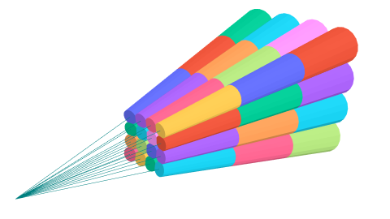
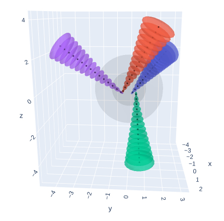
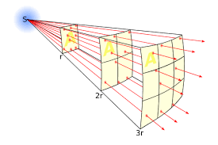

# Computational Robotics Computer Vision Project: NeRF or Nothing

## Goal

The goal of this assignment was to learn about Neural Radiance Fields. The learning process was two-fold:

1. Research NeRFs and understand how they work (understanding them from a theoretical perspective).
2. Recreate some of the NeRF functionality for ourselves (understanding the implementation). 

## Approach / Methadology
For this project, we first had to learn *a lot* about NeRFs and the underlying ML and computer vision theory that allows them to work.

We knew that given the time constraints of the project and our excessive curricular obligations, we needed an accessible library to help us implement NeRFs. Implementing them from scratch would have been over-scoped- and we wanted to use NeRFs for robotics applications moving forward. Thus, the goal was to learn how to use NeRFs to then generate meshes and Signed Distance Functions that we could use for other localization and more involved computer vision projects.  After researching, we found NeRF Studio, a NeRF API created by researchers at UC Berkeley. They provide scaffolding and infrastructure for the creation, usage, training, and rendering of NeRFs. We installed an iOS app called PolyMap that is usually for photogrammetry, and put that into dev mode so we could download their raw data. Nerf Studio has infrastructure for processing data from Polymap directly, so getting the data for our models ended up being a pretty straight-forward process.

To learn how NeRFs are implemented at a software-level we decided to do what we have been doing for our independent study in Deep Reinforcement Learning. The assignments in that class essentially leave certain functions or sections of code blank so that students create those algorithms for themselves. We did something similar, where we essentially gave each other "TODOs" that seemed algorithmically interesting within NeRF studio's existing codebase, and had each of us implement those functions ourselves. The functions we decided to focus on were the renderers, because they had intuitive behaviors and directly related to the NeRFs output. We didn't pay as much attention to scaffolding and data manipulation, for example. The three renderers we decided to re-write parts of were:

1. The Accumulation Renderer
2. The Depth Renderer
3. The RGB Renderer

## Explanation of Neural Radiance Fields (NeRF)

A Neural Radiance Field (NeRF) is a neural network-based method of creating new, photorealistic depictions of 3D scenes. To train a NeRF, one inputs a collection of images, along with their pose and orientation, into a neural network. This network interprets them in 3D space by casting rays through the images, training a continuous 3D function that contains color values matching those projected from the training images.

To create a new image from the NeRF, a clever sampling method is used. Imagine drawing a conic region through the image that grows larger as it approaches the camera. At each step along the vector, colors are sampled within a frustrum and accumulated along with depth and opacity values, which are weighted by the distance from neighboring samples. This blending of color, density, and depth values determines the final value at each pixel.

Here we can see the method with which rays are projected through an image. Each ray has an associated pixel and color value.

  
Citation - NeRFology

  
NeRF Paper

We project these rays for each of our training images. The data for these images is defined using a pose (x,y,z), an orientation (phi,theta), and an rgb image.

Image Projection  

Once the conic rays are cast through the image. We train our Radiance Field on the color values from the rays. Once we are done training, we will have a Neural Radiance Field.

  
NeRFology

This field cannot give us images directly. Our goal is to produce RGB values for a defined pose and orientation of a viewer camera within a scene. To produce this result we must use a method of raycasting frustrums back towards our camera using a series of Color, Depth, and Density Renderers.

Projected frustrums casting outwards from within a scene.  
  
NeRFology

Raycasting does have some drawbacks, however. Because it relies on sampling the field, it is entirely possible to over or under represent portions of the field which have high variance in color value, especially if uniform (equally spaced) sampling is used.

Here we have a uniformly and non uniformly sampled ray. Sampling more near highly variant regions will yield more accurate renders.  

In the actual NeRF model, we do both. We take a course sample of our NeRF using uniform sampling and then use the results to inform a fine pass where we sample more in variant regions.

After sampling, we have successfully created a new representation of our scene using a NeRF!

## Code Implementation

We used NerfStudio to create NeRFs using image and orientation data collected from the PolyCam app.

Further modifications were made to how the renderers determine density, color, and depth values. The AccumulationRenderer now includes a light intensity correction according to the inverse square law, for more realistic color blending.

Depth renderer changes include a weighted median for depth values and robust filtering to handle outliers in the dataset. Outliers are images whose RGB values do not match well with their pose, but dataset pruning helps mitigate this issue.

We also added gamma correction to our RGB renderer. This adjustment isn't theoretically necessary but does improve details in shadows and display quality.

### Jessica's Normalization Explanation

TODO: Jessica's explanation about normalization.

## Trained and Altered NeRF Representations

Citations:

Cone_projection image:

- Original NeRF paper citation:

  - @inproceedings{mildenhall2020nerf,
  - title={NeRF: Representing Scenes as Neural Radiance Fields for View Synthesis},
  - author={Ben Mildenhall and Pratul P. Srinivasan and Matthew Tancik and Jonathan T. Barron and Ravi Ramamoorthi and Ren Ng},
  - year={2020},
  - booktitle={ECCV},
  - }

- NerfStudio Citation
- NerfStudio Citation
- NerfStudio Citation
